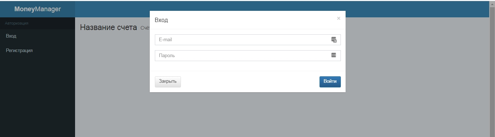
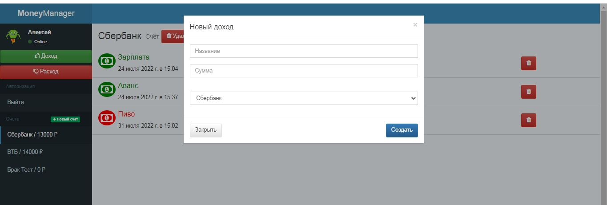

# Кносаль Вячеслав Михайлович

  
  
## Опыт работы:

### `Frontend-разработчик` (стажер)  
**15.10.2023 - н/в.**   
Лига А "HTML Academy"  
Удаленная стажировка. Реализация коммерческих проектов по критериям качества компании и ТЗ клиентов. Работа в команде разработчиков, менеджеров, тестировщиков.

**Во время работы использовал:**
- HTML, PUG
- CSS, SCSS
- JS (ES5, ES6)
- методология BEM
- Git
- Gulp, Webpuck
- Figma
- различные плагины и библиотеки

**Обязанности:**
- соблюдать критерии качества компании и ТЗ клиента
- поддерживать различные версии браузеров и операционных систем
- самостоятельно тестировать свою работу
- создавать интерактивные блоки (слайдеры, табы, фильтрация и сортировка, модальные окна и формы с валидацией и анимацией)
- доработка компонентов;
- разработка интерфейса;
- помощь другим стажёрам по различным вопросам

### `Специалист по информационной безопасности`
**05.06.2018 - н/в.**  
ВУНЦ СВ ОВА ВС РФ  

**Обязанности:**
- Администрированием локального ресурса организации (доработка компонентов, разработка интерфейса, обновление контента);
- Разработка технической документации;
- Организация мероприятий по защите информации;
- Установка и настройка средств защиты информации;
- Контроль проведения технических мероприятий.

**Достижения:**
- Перевел сайт на flexbox / grid;
- Провел декомпозицию кода;
- Добавил валидацию форм;
- Внедрил сборщик gulp;
- Разработал практические инструкции и рекомендации по установке, настройке и эксплуатции средств защиты.

### `Преподаватель`  
**01.06.2016 - 01.06.2018 г.**   
Колледж экономики управления и права   

**Обязанности:**
- Чтение лекций;
- Проведение групповых/практических занятий;
- Создание учебных планов;
- Создание курсов и новых образовательных программ;
- Кураторская работа.
  
**Основные предметы:**
- Современные Web-технологии (html/css/js); 
- Компьютерная графика;
- Сетевые технологии.
  
**Достижения:**
- Разработал программы обучения по преподаваемым дисциплинам;
- Разработал лекционные и практические занятия;

## Образование:
- `2018`  
**Магистр**: Донской государственный технический университет (красный диплом)   
Факультет: Информатика и вычислительная техника  
Специальность: Информатика и вычислительная техника   
- `2016`  
**Бакалавр**: Донской государственный технический университет (красный диплом)  
Факультет: Информатика и вычислительная техника  
Специальность: Информатика и вычислительная техника

### Награды и сертификаты:
- `2023`   
_(19.09.2022 - 18.10.2023)_  **HTML Academy**: Фронтенд-разработчик    
_(21.05.2023 - 22.06.2023)_  **HTML Academy**: Вёрстка React-компонентов      
 _(18.04.2023 - 20.05.2023)_  **HTML Academy**: Подготовка вёрстки для CMS      
_(11.10.2021 - 22.08.2022)_  **Нетология**: Программист на JavaScript  
- `2022`  
_(26.02.2018 - 04.04.2018)_  **HTML Academy**:  HTML и CSS. Профессиональная вёрстка   

## Контакты:

- `Телефон:` +7 (928) 273-21-22
- `Email:`	jiupuk2015@yandex.ru
- `Github`  github.com/knosal
- `Vk:`    vk.com/v.knosal
- `Telegram:`    @v_knosal
- `Discord:`    vyacheslavknosal
    
## Ключевые навыки и инструменты:
1. Уверенные знания Css3 (sass) / HTML5 (БЭМ, PUG) / JavaScript (npm, Nodejs).
2. Понимание работы Git (gitbash) / GitHub.
3. Умение работать с графикой в Photoshop, Figma, Gimp.
4. Базовые знания работы на WordPress, Joomla, Bootstrap.
5. Настройка окружения node.js, npm, Eslint.
6. Имею опыт, понимаю принцип работы в библиотеках Swiper / Leafet.
7. Кроссбраузерная / Адаптивная верстка.
8. Работал со сборщиком: Gulp, изучаю Webpack.
9. Использовал текстовый редактор: VS Code, Sublime Text.

## Мои работы:

### Лендинг:
1. [Верстка лендинга "Masa"](https://knosal.github.io/Accelerator-masa/) | [Проект на Github](https://github.com/knosal/Accelerator-masa)  

    

3. [Верстка лендинга "Петешествия"](https://knosal.github.io/LifeTour/) | [Проект на Github](https://github.com/knosal/LifeTour)  

   

5. [Верстка лендинга "Фитнес"](https://knosal.github.io/fitness_2.0/) | [Проект на Github](https://github.com/knosal/fitness_2.0)  

    
    
6. [Верстка лендинга "Магазин напитков"](https://knosal.github.io/122895-grading/) | [Проект на Github](https://github.com/knosal/122895-grading)   

    
    
7. [Верстка лендинга "Блог"](https://knosal.github.io/mq-diplom-adaptiv/) | [Проект на Github](https://github.com/knosal/mq-diplom-adaptiv)

   

9. [Верстка лендинга "Фирменные товары ICNDY"](https://knosal.github.io/sportIcndy/) | [Проект на Github](https://github.com/knosal/sportIcndy)

   

### Интернет-магазин:
1. [Верстка  Интернет-магазина "Устройства"](https://knosal.github.io/122895-device/) | [Проект на Github]()

   

3. [Верстка Интернет-магазина "Мороженное"](https://knosal.github.io/122895-gllacy-35/) | [Проект на Github](https://github.com/knosal/122895-gllacy-35)

   

5. [Верстка Интернет-магазина "Мишка"](https://knosal.github.io/122895-mishka-27/index.html) | [Проект на Github](https://github.com/knosal/122895-mishka-27) 

   

### JS-проекты:
1. [Приложение для управления финансами "ManeyManager"](https://knosal.github.io/bhj-diploma/) | [Проект на Github](https://github.com/knosal/bhj-diploma)

    Приложение для управления финансами.  Сервис предполагает следующий функционал: `Регистрация` | `Авторизация`| `Выход` | `Создание счетов` | `Удаление счетов` | `Создание транзакций` | `Удаление транзакций`.

    
    
   
2. [Одностраничное приложение "Кекстаграм"](https://knosal.github.io/122895-kekstagram-28/) | [Проект на Github](https://github.com/knosal/122895-kekstagram-28)

    Кекстаграм — сервис просмотра изображений. Пользователям предоставлена возможность загружать свои фотографии или просматривать фотографии, загруженные ранее другими пользователями.

  
    
2. [Одностраничное приложение "Счетчик калорий"](https://knosal.github.io/calorieCounter/) | [Проект на Github](https://github.com/knosal/calorieCounter) 

   Приложение позволяет рассчитать индивидуальную суточную норму калорий. Интерфейс состоит из формы с полями ввода и блока для вывода результата.

   

5. [Одностраничное приложение "Сайт объявлений"](https://knosal.github.io/craigslist/) | [Проект на Github](https://github.com/knosal/craigslist)

   Одностраничное приложение на JavaScript, которое будет работать в браузере — список объявлений о продаже товаров и модальное окно с подробной информацией о каждом товаре. Приложение позволяет выбрать товары разных категорий, отфильтровать их по цене и другим характеристикам, отсортировать, добавить в избранное, открыть подробное объявление с описанием каждого товара. Интерфейс интернет-магазина включает в себя страницу с объявлениями, HTML-форму с фильтрами, модальное окно для вывода подробной информации о товаре. Чтобы получить информацию о товарах, вам нужно будет запрограммировать загрузку данных с сервера.
   
   

## Обо мне:

Мне нравится продумывать структуру проектов, реализовывать ее и видеть результат.
Я активно занимаюсь поиском новых технологий и слежу за тенденциями и достижениями отрасли. Не боюсь ответственности и умею самостоятельно принимать решения. 
В свободное время хожу на лекции и конференции, учусь.

**Frontend meetup forever** - ничто не сравнится с атмосферой при проведении пободных мероприятий. 

Хочу развиваться в передовой IT-сфере: улучшать свои навыки, чтобы создавать масштабные и полезные сервисы в команде единомышленников.

Абсолютная бесконфликтность, спокойствие, рассудительность, умение находить компромиссы. Есть опыт работы руководителем.

## Хобби:

- В свободное время увлекаюсь фотографией, развито чувство прекрасного.
- Читаю книги по психологии и саморазвитию.
- Плавание и Сайкл.
- Настольные игры (настолочки).
