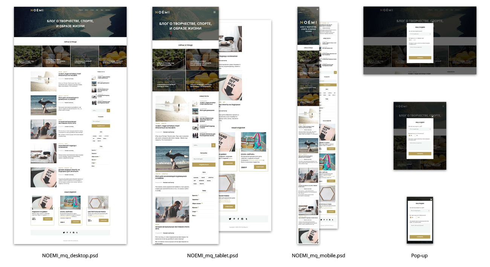
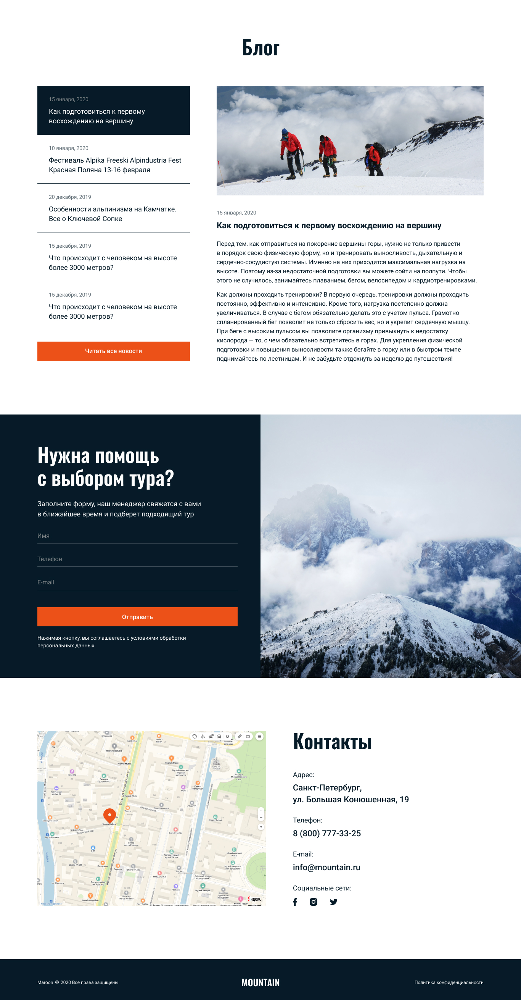

# Кносаль Вячеслав Михайлович

## Обо мне:

С 2016 по 2018 год преподавал в колледже «экономики управления и права» при университете, в том числе компьютерные сети и современные web-технологии, понимаю принципы работы браузера.

С 2019 года работаю специалистом в области безопасности информации, помимо прочего, занимаюсь администрированием сайта организации (доработка компонентов, разработка интерфейса, обновление контента), были исправлены ошибки существующего веб-сайта и реализованы улучшения, которые значительно улучшили функциональность.

## Навыки:
1. Углубленные знания Css / HTML5 / JavaScript.
2. Понимание работы Git / GitHub.
3. Умение работать с графикой в Photoshop, Figma, Gimp.
4. Базовые знания работы на WordPress, Joomla, Bootstrap.

## Мои работы:

1. [Дипломный проект курса «Профессиональный HTML & CSS»](https://knosal.github.io/122895-device/#)

2. [Дипломный проект №1 курса «Программист на JavaScript»: «Адаптивная и мобильная верстка»](https://knosal.github.io/mq-diplom-adaptiv/#0)

3. [Дипломный проект №2 курса «Программист на JavaScript»](https://knosal.github.io/mq-diplom-adaptiv/#0)

4. [Проект №1](https://knosal.github.io/Mountain/)

5. [Проект №2](https://knosal.github.io/Culture-news/)

6. [Проект №3](https://knosal.github.io/sportIcndy/)

